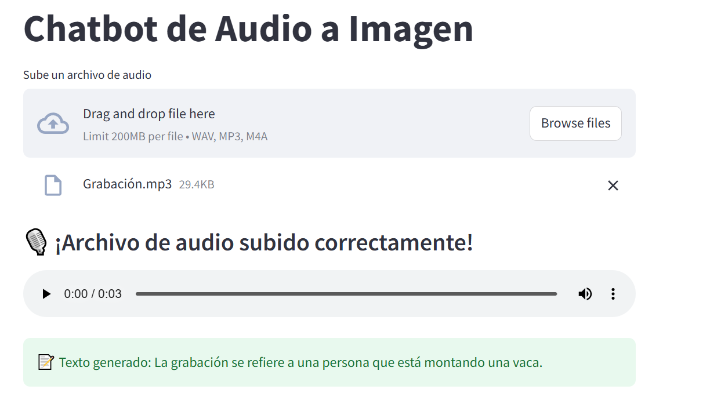

Para iniciar el proyecto y ejecutarlo de forma correcta se tiene que hacer lo siguiente:

1)  pip install -r requirements.txt Con esto se instalaran las dependencias necesarias para ejecutar el proyecto de manera local.

2)  En la consola de comandos te diriges a la ruta donde se encuentra el archivo app.py y luego ejecutaras el siguiente comando: "streamlit run app.py" De esta manera el proyecto se ejecutara y         abrira una ventana en nuestro navegador. En caso de no hacerlo streamlit dejara un url local en la terminal el cual se copia y pega en el navegador a usar.

3)  Subes un archivo en el boton "Browse files". Estos archivos de audio tienen que ser de formato .mp3 o .wav

Esto tomara un tiempo dependiendo de la eficacia del internet que se este usando.

DIAGRAMA DE FLUJO.

